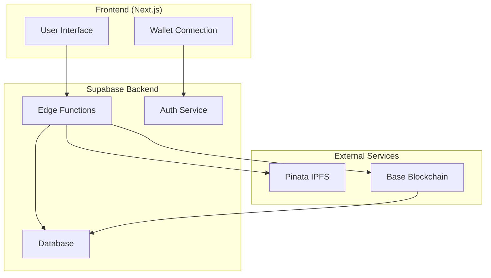

# CosmiFi Backend Implementation Roadmap

## Overview

This document provides a comprehensive implementation roadmap for the CosmiFi backend, which serves as the bridge between the frontend application and the blockchain smart contracts. The backend is built using Supabase Edge Functions and handles authentication, file storage, metadata generation, and database operations.

## Architecture



## Key Components

### 1. Authentication Layer
- **Purpose**: Secure user authentication using Ethereum wallet signatures
- **Implementation**: JWT-based authentication with wallet signature verification
- **Integration**: Connects with Supabase Auth and frontend wallet connection

### 2. Storage Layer
- **Purpose**: Decentralized file storage for CAD files and metadata
- **Implementation**: IPFS integration via Pinata service
- **Integration**: Stores CAD files, preview images, and metadata JSON

### 3. Database Layer
- **Purpose**: Indexing and event synchronization
- **Implementation**: Supabase PostgreSQL with Row Level Security (RLS)
- **Integration**: Caches blockchain data and provides fast queries for frontend

### 4. API Layer
- **Purpose**: RESTful endpoints for all operations
- **Implementation**: Supabase Edge Functions with TypeScript
- **Integration**: Connects frontend with all backend services

## Implementation Phases

### Phase 1: Foundation Setup (Week 1)

#### 1.1 Supabase Project Configuration
- Create new Supabase project
- Configure Edge Functions runtime
- Set up database with required tables
- Configure Row Level Security (RLS) policies

#### 1.2 Database Schema Implementation
```sql
-- Profiles table for user information
CREATE TABLE profiles (
  wallet_address TEXT PRIMARY KEY,
  username TEXT,
  bio TEXT,
  avatar_url TEXT,
  social_links JSONB DEFAULT '{}',
  created_at TIMESTAMP WITH TIME ZONE DEFAULT NOW(),
  updated_at TIMESTAMP WITH TIME ZONE DEFAULT NOW()
);

-- Designs table for NFT design data
CREATE TABLE designs (
  id BIGINT GENERATED BY DEFAULT AS IDENTITY PRIMARY KEY,
  token_id BIGINT UNIQUE,
  owner_address TEXT NOT NULL,
  metadata_cid TEXT,
  name TEXT,
  description TEXT,
  category TEXT,
  tags TEXT[] DEFAULT '{}',
  version TEXT DEFAULT 'v1.0',
  license TEXT DEFAULT 'CC-BY-4.0',
  preview_cid TEXT,
  cad_zip_cid TEXT,
  status TEXT DEFAULT 'draft' CHECK (status IN ('draft', 'uploaded', 'metadata_ready', 'minted')),
  created_at TIMESTAMP WITH TIME ZONE DEFAULT NOW(),
  updated_at TIMESTAMP WITH TIME ZONE DEFAULT NOW(),
  minted_at TIMESTAMP WITH TIME ZONE
);

-- Enable RLS
ALTER TABLE profiles ENABLE ROW LEVEL SECURITY;
ALTER TABLE designs ENABLE ROW LEVEL SECURITY;

-- Create policies
CREATE POLICY "Public profiles are viewable by everyone" ON profiles FOR SELECT USING (true);
CREATE POLICY "Users can insert their own profile" ON profiles FOR INSERT WITH CHECK (auth.jwt() ->> 'wallet_address' = wallet_address);
CREATE POLICY "Users can update own profile" ON profiles FOR UPDATE USING (auth.jwt() ->> 'wallet_address' = wallet_address);

CREATE POLICY "Designs are viewable by everyone" ON designs FOR SELECT USING (true);
CREATE POLICY "Users can insert their own designs" ON designs FOR INSERT WITH CHECK (auth.jwt() ->> 'wallet_address' = owner_address);
CREATE POLICY "Users can update own designs" ON designs FOR UPDATE USING (auth.jwt() ->> 'wallet_address' = owner_address);
```

#### 1.3 Backend Directory Structure
```
backend/
├── supabase/
│   ├── functions/
│   │   ├── _shared/
│   │   │   ├── middleware/
│   │   │   │   └── auth.ts
│   │   │   ├── utils/
│   │   │   │   ├── ipfs.ts
│   │   │   │   ├── jwt.ts
│   │   │   │   └── validation.ts
│   │   │   └── types/
│   │   │       └── index.ts
│   │   ├── auth/
│   │   │   ├── verify-wallet.ts
│   │   │   └── register-designer.ts
│   │   ├── profiles/
│   │   │   ├── create-profile.ts
│   │   │   ├── get-profile.ts
│   │   │   └── update-profile.ts
│   │   ├── designs/
│   │   │   ├── upload-files.ts
│   │   │   ├── create-draft.ts
│   │   │   ├── generate-metadata.ts
│   │   │   ├── prepare-mint.ts
│   │   │   └── get-designs.ts
│   │   └── webhook/
│   │       └── nft-minted.ts
│   ├── migrations/
│   │   └── *.sql
│   └── config.toml
├── package.json
├── tsconfig.json
├── .env.example
└── README.md
```

### Phase 2: Authentication & Security (Week 1-2)

#### 2.1 Wallet Signature Verification
Implement secure JWT authentication using Ethereum wallet signatures:

```typescript
// _shared/middleware/auth.ts
import { createClient } from 'https://esm.sh/@supabase/supabase-js@2'
import { JWTPayload } from '../types/index.ts'

const supabase = createClient(
  Deno.env.get('SUPABASE_URL')!,
  Deno.env.get('SUPABASE_SERVICE_ROLE_KEY')!
)

export interface AuthenticatedRequest extends Request {
  user: {
    id: string
    user_metadata: {
      wallet_address: string
    }
  }
}

export async function authMiddleware(req: Request): Promise<Response | null> {
  const authHeader = req.headers.get('Authorization')
  
  if (!authHeader || !authHeader.startsWith('Bearer ')) {
    return new Response(JSON.stringify({ error: 'Missing or invalid token' }), {
      status: 401,
      headers: { 'Content-Type': 'application/json' }
    })
  }
  
  const token = authHeader.substring(7)
  const { data: { user }, error } = await supabase.auth.getUser(token)
  
  if (error || !user) {
    return new Response(JSON.stringify({ error: 'Invalid token' }), {
      status: 401,
      headers: { 'Content-Type': 'application/json' }
    })
  }
  
  // Attach user info to request context
  (req as AuthenticatedRequest).user = user
  return null // Continue processing
}
```

#### 2.2 JWT Token Generation
```typescript
// _shared/utils/jwt.ts
import { create } from 'https://deno.land/x/djwt@v2.8/mod.ts'
import { JWTPayload } from '../types/index.ts'

const JWT_SECRET = Deno.env.get('JWT_SECRET')!

export function generateJWT(payload: Omit<JWTPayload, 'exp' | 'iat'>): string {
  const now = Math.floor(Date.now() / 1000)
  const jwtPayload: JWTPayload = {
    ...payload,
    iat: now,
    exp: now + 24 * 60 * 60 // 24 hours
  }
  
  return create({ alg: 'HS512', typ: 'JWT' }, jwtPayload, JWT_SECRET)
}
```

### Phase 3: IPFS Integration (Week 2)

#### 3.1 Pinata Service Implementation
Create a robust IPFS integration service:

```typescript
// _shared/utils/ipfs.ts
const PINATA_API_KEY = Deno.env.get('PINATA_API_KEY')!
const PINATA_SECRET_KEY = Deno.env.get('PINATA_SECRET_KEY')!

export async function pinFileToIPFS(file: File, name?: string): Promise<PinataResponse> {
  const formData = new FormData()
  formData.append('file', file)
  
  if (name) {
    const options = JSON.stringify({
      pinataMetadata: { name }
    })
    formData.append('pinataOptions', options)
  }
  
  const response = await fetch('https://api.pinata.cloud/pinning/pinFileToIPFS', {
    method: 'POST',
    headers: {
      'pinata_api_key': PINATA_API_KEY,
      'pinata_secret_api_key': PINATA_SECRET_KEY
    },
    body: formData
  })
  
  if (!response.ok) {
    const error = await response.text()
    throw new Error(`IPFS upload failed: ${error}`)
  }
  
  return response.json()
}

export async function pinJSONToIPFS(json: any, name?: string): Promise<PinataResponse> {
  const response = await fetch('https://api.pinata.cloud/pinning/pinJSONToIPFS', {
    method: 'POST',
    headers: {
      'Content-Type': 'application/json',
      'pinata_api_key': PINATA_API_KEY,
      'pinata_secret_api_key': PINATA_SECRET_KEY
    },
    body: JSON.stringify({
      pinataContent: json,
      pinataMetadata: name ? { name } : undefined
    })
  })
  
  if (!response.ok) {
    const error = await response.text()
    throw new Error(`IPFS JSON upload failed: ${error}`)
  }
  
  return response.json()
}
```

### Phase 4: Core Edge Functions (Week 2-3)

#### 4.1 File Upload Function
Handle CAD files and preview image uploads:

```typescript
// functions/designs/upload-files/index.ts
import { serve } from "https://deno.land/std@0.168.0/http/server.ts"
import { pinFileToIPFS } from '../../_shared/utils/ipfs.ts'
import { authMiddleware, AuthenticatedRequest } from '../../_shared/middleware/auth.ts'

serve(async (req: Request) => {
  // Handle authentication
  const authError = await authMiddleware(req)
  if (authError) return authError
  
  if (req.method !== 'POST') {
    return new Response('Method not allowed', { status: 405 })
  }
  
  try {
    const formData = await req.formData()
    const cadFile = formData.get('cadFile') as File
    const previewFile = formData.get('previewFile') as File
    
    if (!cadFile || !previewFile) {
      return new Response(JSON.stringify({ error: 'Both CAD and preview files required' }), {
        status: 400,
        headers: { 'Content-Type': 'application/json' }
      })
    }
    
    // Validate file types
    const allowedCadTypes = ['application/zip', 'application/x-zip-compressed']
    const allowedImageTypes = ['image/png', 'image/jpeg', 'image/webp']
    
    if (!allowedCadTypes.includes(cadFile.type)) {
      return new Response(JSON.stringify({ error: 'CAD file must be a ZIP archive' }), {
        status: 400,
        headers: { 'Content-Type': 'application/json' }
      })
    }
    
    if (!allowedImageTypes.includes(previewFile.type)) {
      return new Response(JSON.stringify({ error: 'Preview file must be PNG, JPG, or WebP' }), {
        status: 400,
        headers: { 'Content-Type': 'application/json' }
      })
    }
    
    // Validate file sizes (50MB limit)
    const maxSize = 50 * 1024 * 1024
    if (cadFile.size > maxSize || previewFile.size > maxSize) {
      return new Response(JSON.stringify({ error: 'Files must be smaller than 50MB' }), {
        status: 400,
        headers: { 'Content-Type': 'application/json' }
      })
    }
    
    // Upload files to IPFS
    const [cadResult, previewResult] = await Promise.all([
      pinFileToIPFS(cadFile, `cad-${Date.now()}`),
      pinFileToIPFS(previewFile, `preview-${Date.now()}`)
    ])
    
    return new Response(JSON.stringify({
      cadZipCid: cadResult.IpfsHash,
      previewCid: previewResult.IpfsHash,
      cadSize: cadResult.PinSize,
      previewSize: previewResult.PinSize
    }), {
      headers: { 'Content-Type': 'application/json' }
    })
  } catch (error) {
    return new Response(JSON.stringify({ error: error.message }), {
      status: 500,
      headers: { 'Content-Type': 'application/json' }
    })
  }
})
```

#### 4.2 Metadata Generation Function
Generate and pin NFT metadata to IPFS:

```typescript
// functions/designs/generate-metadata/index.ts
import { serve } from "https://deno.land/std@0.168.0/http/server.ts"
import { pinJSONToIPFS } from '../../_shared/utils/ipfs.ts'
import { authMiddleware, AuthenticatedRequest } from '../../_shared/middleware/auth.ts'

interface MetadataRequest {
  name: string
  description: string
  category: string
  tags: string[]
  version: string
  license: string
  previewCid: string
  cadZipCid: string
  additionalNotes?: string
}

serve(async (req: Request) => {
  const authError = await authMiddleware(req)
  if (authError) return authError
  
  if (req.method !== 'POST') {
    return new Response('Method not allowed', { status: 405 })
  }
  
  try {
    const data: MetadataRequest = await req.json()
    const walletAddress = (req as AuthenticatedRequest).user.user_metadata.wallet_address
    
    // Generate metadata JSON
    const metadata = {
      name: data.name,
      description: data.description,
      image: `ipfs://${data.previewCid}`,
      cad_zip: `ipfs://${data.cadZipCid}`,
      creator: walletAddress,
      category: data.category,
      version: data.version,
      tags: data.tags,
      license: data.license,
      attributes: [
        { trait_type: "Component Type", value: data.category },
        { trait_type: "Format", value: "CAD" }
      ]
    }
    
    // Pin metadata to IPFS
    const result = await pinJSONToIPFS(metadata, `metadata-${Date.now()}`)
    
    return new Response(JSON.stringify({
      metadataCid: result.IpfsHash,
      metadata
    }), {
      headers: { 'Content-Type': 'application/json' }
    })
  } catch (error) {
    return new Response(JSON.stringify({ error: error.message }), {
      status: 500,
      headers: { 'Content-Type': 'application/json' }
    })
  }
})
```

### Phase 5: Database Integration (Week 3)

#### 5.1 Design Management Functions
Implement CRUD operations for designs:

```typescript
// functions/designs/create-draft/index.ts
import { serve } from "https://deno.land/std@0.168.0/http/server.ts"
import { createClient } from 'https://esm.sh/@supabase/supabase-js@2'
import { authMiddleware, AuthenticatedRequest } from '../../_shared/middleware/auth.ts'

const supabase = createClient(
  Deno.env.get('SUPABASE_URL')!,
  Deno.env.get('SUPABASE_SERVICE_ROLE_KEY')!
)

serve(async (req: Request) => {
  const authError = await authMiddleware(req)
  if (authError) return authError
  
  if (req.method !== 'POST') {
    return new Response('Method not allowed', { status: 405 })
  }
  
  try {
    const { name, description, category, tags, version, license, previewCid, cadZipCid } = await req.json()
    const walletAddress = (req as AuthenticatedRequest).user.user_metadata.wallet_address
    
    const { data, error } = await supabase
      .from('designs')
      .insert({
        name,
        description,
        category,
        tags,
        version,
        license,
        preview_cid: previewCid,
        cad_zip_cid: cadZipCid,
        owner_address: walletAddress,
        status: 'uploaded'
      })
      .select()
      .single()
    
    if (error) throw error
    
    return new Response(JSON.stringify({ design: data }), {
      headers: { 'Content-Type': 'application/json' }
    })
  } catch (error) {
    return new Response(JSON.stringify({ error: error.message }), {
      status: 500,
      headers: { 'Content-Type': 'application/json' }
    })
  }
})
```

### Phase 6: Webhook Integration (Week 3-4)

#### 6.1 NFT Minted Webhook
Handle blockchain events for design minting:

```typescript
// functions/webhook/nft-minted/index.ts
import { serve } from "https://deno.land/std@0.168.0/http/server.ts"
import { createClient } from 'https://esm.sh/@supabase/supabase-js@2'

const supabase = createClient(
  Deno.env.get('SUPABASE_URL')!,
  Deno.env.get('SUPABASE_SERVICE_ROLE_KEY')!
)

serve(async (req: Request) => {
  if (req.method !== 'POST') {
    return new Response('Method not allowed', { status: 405 })
  }
  
  try {
    const { tokenId, owner, metadataCid, collectionAddress } = await req.json()
    
    // Update design record with minting information
    const { data, error } = await supabase
      .from('designs')
      .update({
        token_id: tokenId,
        owner_address: owner,
        metadata_cid: metadataCid,
        collection_address: collectionAddress,
        status: 'minted',
        minted_at: new Date().toISOString()
      })
      .eq('metadata_cid', metadataCid)
      .select()
      .single()
    
    if (error) throw error
    
    return new Response(JSON.stringify({ success: true, design: data }), {
      headers: { 'Content-Type': 'application/json' }
    })
  } catch (error) {
    return new Response(JSON.stringify({ error: error.message }), {
      status: 500,
      headers: { 'Content-Type': 'application/json' }
    })
  }
})
```

## Frontend Integration

### 1. Authentication Flow
```typescript
// Frontend wallet authentication
import { ethers } from 'ethers'

async function authenticateWithWallet() {
  // Connect wallet
  const provider = new ethers.BrowserProvider(window.ethereum)
  const signer = await provider.getSigner()
  const address = await signer.getAddress()
  
  // Create message to sign
  const message = `Login to CosmiFi at ${new Date().toISOString()}`
  const signature = await signer.signMessage(message)
  
  // Send to backend for verification
  const response = await fetch('/auth/verify-wallet', {
    method: 'POST',
    headers: { 'Content-Type': 'application/json' },
    body: JSON.stringify({ walletAddress: address, signature, message })
  })
  
  const { token } = await response.json()
  localStorage.setItem('authToken', token)
  
  return { address, token }
}
```

### 2. File Upload Flow
```typescript
// Frontend file upload
async function uploadDesignFiles(cadFile, previewFile) {
  const token = localStorage.getItem('authToken')
  
  const formData = new FormData()
  formData.append('cadFile', cadFile)
  formData.append('previewFile', previewFile)
  
  const response = await fetch('/designs/upload-files', {
    method: 'POST',
    headers: { 'Authorization': `Bearer ${token}` },
    body: formData
  })
  
  return response.json()
}
```

### 3. Minting Flow
```typescript
// Frontend minting integration
async function mintDesign(metadataCid) {
  const token = localStorage.getItem('authToken')
  
  // Generate metadata
  const metadataResponse = await fetch('/designs/generate-metadata', {
    method: 'POST',
    headers: {
      'Authorization': `Bearer ${token}`,
      'Content-Type': 'application/json'
    },
    body: JSON.stringify(metadataData)
  })
  
  const { metadataCid } = await metadataResponse.json()
  
  // Call smart contract to mint
  const provider = new ethers.BrowserProvider(window.ethereum)
  const signer = await provider.getSigner()
  const contract = new ethers.Contract(contractAddress, abi, signer)
  
  const tx = await contract.mintDesign(metadataCid)
  await tx.wait()
  
  return tx.hash
}
```

## Smart Contract Integration

### 1. Designer Registration
```typescript
// Register designer on blockchain
async function registerDesigner() {
  const provider = new ethers.BrowserProvider(window.ethereum)
  const signer = await provider.getSigner()
  
  // Get registry contract
  const registry = new ethers.Contract(registryAddress, registryAbi, signer)
  
  // Register designer
  const tx = await registry.registerDesigner()
  await tx.wait()
  
  return tx.hash
}
```

### 2. Collection Creation
```typescript
// Create collection for designer
async function createCollection(name, symbol) {
  const provider = new ethers.BrowserProvider(window.ethereum)
  const signer = await provider.getSigner()
  
  // Get factory contract
  const factory = new ethers.Contract(factoryAddress, factoryAbi, signer)
  
  // Create collection
  const tx = await factory.createCollection(name, symbol)
  const receipt = await tx.wait()
  
  // Extract collection address from event
  const event = receipt.events.find(e => e.event === 'CollectionCreated')
  return event.args.collection
}
```

## Environment Variables

Create `.env.example` file with all required environment variables:

```env
# Supabase Configuration
SUPABASE_URL=your_supabase_project_url
SUPABASE_SERVICE_ROLE_KEY=your_supabase_service_role_key
SUPABASE_ANON_KEY=your_supabase_anon_key

# Pinata Configuration
PINATA_API_KEY=your_pinata_api_key
PINATA_SECRET_KEY=your_pinata_secret_key

# JWT Configuration
JWT_SECRET=your_jwt_secret_key_at_least_32_characters_long

# Blockchain Configuration
RPC_BASE_SEPOLIA=your_base_sepolia_rpc_url
CONTRACT_ADDRESS=your_deployed_contract_address
FACTORY_ADDRESS=your_deployed_factory_address
REGISTRY_ADDRESS=your_deployed_registry_address
```

## Testing Strategy

1. **Unit Tests**: Test individual utility functions
2. **Integration Tests**: Test Edge Functions with Supabase
3. **E2E Tests**: Test complete upload and minting flow
4. **Load Testing**: Test file upload performance

## Deployment Steps

1. Initialize Supabase project
2. Set up database schema and migrations
3. Configure environment variables
4. Deploy Edge Functions using Supabase CLI
5. Set up webhooks for blockchain events
6. Test complete integration with frontend

## Security Considerations

1. Implement proper JWT validation
2. Use Row Level Security (RLS) policies
3. Validate file types and sizes
4. Rate limiting for API endpoints
5. Secure handling of API keys
6. Input sanitization and validation

## Performance Optimizations

1. Implement file compression
2. Use CDN for IPFS content
3. Optimize database queries
4. Implement caching strategies
5. Monitor function execution times

This comprehensive implementation roadmap provides a solid foundation for building the Supabase Edge Functions backend for CosmiFi, ensuring security, scalability, and maintainability while supporting the complex workflow of CAD file upload, IPFS storage, and NFT minting.