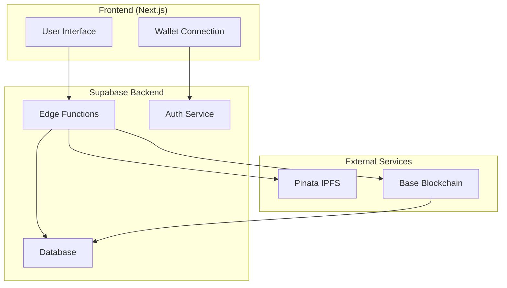

# Supabase Edge Functions Integration Plan for CosmiFi Backend

## Overview

This document outlines the comprehensive plan for implementing Supabase Edge Functions as the backend infrastructure for the CosmiFi engineering NFT platform. The implementation will use TypeScript with JWT authentication via wallet signatures for secure user identification, and Pinata for IPFS integration.

## Architecture Diagram



## Backend Directory Structure

```
backend/
├── supabase/
│   ├── functions/
│   │   ├── _shared/
│   │   │   ├── middleware/
│   │   │   │   └── auth.ts
│   │   │   ├── utils/
│   │   │   │   ├── ipfs.ts
│   │   │   │   ├── jwt.ts
│   │   │   │   └── validation.ts
│   │   │   └── types/
│   │   │       └── index.ts
│   │   ├── auth/
│   │   │   ├── verify-wallet.ts
│   │   │   └── generate-jwt.ts
│   │   ├── profiles/
│   │   │   ├── create-profile.ts
│   │   │   ├── get-profile.ts
│   │   │   └── update-profile.ts
│   │   ├── designs/
│   │   │   ├── upload-files.ts
│   │   │   ├── create-draft.ts
│   │   │   ├── generate-metadata.ts
│   │   │   ├── prepare-mint.ts
│   │   │   └── get-designs.ts
│   │   └── webhook/
│   │       └── nft-minted.ts
│   ├── migrations/
│   │   └── *.sql
│   └── config.toml
├── package.json
├── tsconfig.json
├── .env.example
└── README.md
```

## Implementation Plan

### Phase 1: Foundation Setup

#### 1. Supabase Project Configuration
- Create new Supabase project
- Configure Edge Functions runtime
- Set up database with required tables
- Configure Row Level Security (RLS) policies

#### 2. Database Schema Implementation
```sql
-- Profiles table for user information
CREATE TABLE profiles (
  wallet_address TEXT PRIMARY KEY,
  username TEXT,
  bio TEXT,
  avatar_url TEXT,
  social_links JSONB,
  created_at TIMESTAMP WITH TIME ZONE DEFAULT NOW(),
  updated_at TIMESTAMP WITH TIME ZONE DEFAULT NOW()
);

-- Designs table for NFT design data
CREATE TABLE designs (
  id BIGINT GENERATED BY DEFAULT AS IDENTITY PRIMARY KEY,
  token_id BIGINT UNIQUE,
  owner_address TEXT NOT NULL,
  metadata_cid TEXT,
  name TEXT,
  description TEXT,
  category TEXT,
  tags TEXT[],
  version TEXT,
  license TEXT,
  preview_cid TEXT,
  cad_zip_cid TEXT,
  status TEXT DEFAULT 'draft' CHECK (status IN ('draft', 'uploaded', 'metadata_ready', 'minted')),
  created_at TIMESTAMP WITH TIME ZONE DEFAULT NOW(),
  updated_at TIMESTAMP WITH TIME ZONE DEFAULT NOW(),
  minted_at TIMESTAMP WITH TIME ZONE
);

-- Enable RLS
ALTER TABLE profiles ENABLE ROW LEVEL SECURITY;
ALTER TABLE designs ENABLE ROW LEVEL SECURITY;

-- Create policies
CREATE POLICY "Users can view all profiles" ON profiles FOR SELECT USING (true);
CREATE POLICY "Users can update own profile" ON profiles FOR UPDATE USING (auth.jwt() ->> 'wallet_address' = wallet_address);
CREATE POLICY "Users can insert own profile" ON profiles FOR INSERT WITH CHECK (auth.jwt() ->> 'wallet_address' = wallet_address);
```

### Phase 2: Authentication & Security

#### 3. Wallet Signature Verification
Implement secure JWT authentication using Ethereum wallet signatures:

```typescript
// _shared/middleware/auth.ts
import { serve } from "https://deno.land/std@0.168.0/http/server.ts"
import { createClient } from 'https://esm.sh/@supabase/supabase-js@2'
import { verifyWalletSignature, generateJWT } from '../utils/jwt.ts'

export async function authMiddleware(req: Request) {
  const authHeader = req.headers.get('Authorization')
  
  if (!authHeader || !authHeader.startsWith('Bearer ')) {
    return new Response(JSON.stringify({ error: 'Missing or invalid token' }), {
      status: 401,
      headers: { 'Content-Type': 'application/json' }
    })
  }
  
  const token = authHeader.substring(7)
  const { data: { user }, error } = await supabase.auth.getUser(token)
  
  if (error || !user) {
    return new Response(JSON.stringify({ error: 'Invalid token' }), {
      status: 401,
      headers: { 'Content-Type': 'application/json' }
    })
  }
  
  // Attach user info to request context
  req.user = user
  return null // Continue processing
}
```

### Phase 3: IPFS Integration

#### 4. Pinata Service Implementation
Create a robust IPFS integration service:

```typescript
// _shared/utils/ipfs.ts
const PINATA_API_KEY = Deno.env.get('PINATA_API_KEY')
const PINATA_SECRET_KEY = Deno.env.get('PINATA_SECRET_KEY')

export interface PinataResponse {
  IpfsHash: string
  PinSize: number
  Timestamp: string
}

export async function pinFileToIPFS(file: File, name?: string): Promise<PinataResponse> {
  const formData = new FormData()
  formData.append('file', file)
  
  if (name) {
    const options = JSON.stringify({
      pinataMetadata: { name }
    })
    formData.append('pinataOptions', options)
  }
  
  const response = await fetch('https://api.pinata.cloud/pinning/pinFileToIPFS', {
    method: 'POST',
    headers: {
      'pinata_api_key': PINATA_API_KEY!,
      'pinata_secret_api_key': PINATA_SECRET_KEY!
    },
    body: formData
  })
  
  if (!response.ok) {
    throw new Error(`IPFS upload failed: ${response.statusText}`)
  }
  
  return response.json()
}

export async function pinJSONToIPFS(json: any, name?: string): Promise<PinataResponse> {
  const response = await fetch('https://api.pinata.cloud/pinning/pinJSONToIPFS', {
    method: 'POST',
    headers: {
      'Content-Type': 'application/json',
      'pinata_api_key': PINATA_API_KEY!,
      'pinata_secret_api_key': PINATA_SECRET_KEY!
    },
    body: JSON.stringify({
      pinataContent: json,
      pinataMetadata: name ? { name } : undefined
    })
  })
  
  if (!response.ok) {
    throw new Error(`IPFS JSON upload failed: ${response.statusText}`)
  }
  
  return response.json()
}
```

### Phase 4: Core Edge Functions

#### 5. File Upload Function
Handle CAD files and preview image uploads:

```typescript
// functions/designs/upload-files.ts
import { serve } from "https://deno.land/std@0.168.0/http/server.ts"
import { pinFileToIPFS } from '../_shared/utils/ipfs.ts'
import { authMiddleware } from '../_shared/middleware/auth.ts'

serve(async (req) => {
  // Handle authentication
  const authError = await authMiddleware(req)
  if (authError) return authError
  
  if (req.method !== 'POST') {
    return new Response('Method not allowed', { status: 405 })
  }
  
  try {
    const formData = await req.formData()
    const cadFile = formData.get('cadFile') as File
    const previewFile = formData.get('previewFile') as File
    
    if (!cadFile || !previewFile) {
      return new Response(JSON.stringify({ error: 'Both CAD and preview files required' }), {
        status: 400,
        headers: { 'Content-Type': 'application/json' }
      })
    }
    
    // Upload files to IPFS
    const [cadResult, previewResult] = await Promise.all([
      pinFileToIPFS(cadFile, `cad-${Date.now()}`),
      pinFileToIPFS(previewFile, `preview-${Date.now()}`)
    ])
    
    return new Response(JSON.stringify({
      cadZipCid: cadResult.IpfsHash,
      previewCid: previewResult.IpfsHash
    }), {
      headers: { 'Content-Type': 'application/json' }
    })
  } catch (error) {
    return new Response(JSON.stringify({ error: error.message }), {
      status: 500,
      headers: { 'Content-Type': 'application/json' }
    })
  }
})
```

#### 6. Metadata Generation Function
Generate and pin NFT metadata to IPFS:

```typescript
// functions/designs/generate-metadata.ts
import { serve } from "https://deno.land/std@0.168.0/http/server.ts"
import { pinJSONToIPFS } from '../_shared/utils/ipfs.ts'
import { authMiddleware } from '../_shared/middleware/auth.ts'

interface MetadataRequest {
  name: string
  description: string
  category: string
  tags: string[]
  version: string
  license: string
  previewCid: string
  cadZipCid: string
  additionalNotes?: string
}

serve(async (req) => {
  const authError = await authMiddleware(req)
  if (authError) return authError
  
  if (req.method !== 'POST') {
    return new Response('Method not allowed', { status: 405 })
  }
  
  try {
    const data: MetadataRequest = await req.json()
    const walletAddress = req.user.user_metadata.wallet_address
    
    // Generate metadata JSON
    const metadata = {
      name: data.name,
      description: data.description,
      image: `ipfs://${data.previewCid}`,
      cad_zip: `ipfs://${data.cadZipCid}`,
      creator: walletAddress,
      category: data.category,
      version: data.version,
      tags: data.tags,
      license: data.license,
      attributes: [
        { trait_type: "Component Type", value: data.category },
        { trait_type: "Format", value: "CAD" }
      ]
    }
    
    // Pin metadata to IPFS
    const result = await pinJSONToIPFS(metadata, `metadata-${Date.now()}`)
    
    return new Response(JSON.stringify({
      metadataCid: result.IpfsHash,
      metadata
    }), {
      headers: { 'Content-Type': 'application/json' }
    })
  } catch (error) {
    return new Response(JSON.stringify({ error: error.message }), {
      status: 500,
      headers: { 'Content-Type': 'application/json' }
    })
  }
})
```

### Phase 5: Database Integration

#### 7. Design Management Functions
Implement CRUD operations for designs:

```typescript
// functions/designs/create-draft.ts
import { serve } from "https://deno.land/std@0.168.0/http/server.ts"
import { createClient } from 'https://esm.sh/@supabase/supabase-js@2'
import { authMiddleware } from '../_shared/middleware/auth.ts'

const supabase = createClient(
  Deno.env.get('SUPABASE_URL')!,
  Deno.env.get('SUPABASE_SERVICE_ROLE_KEY')!
)

serve(async (req) => {
  const authError = await authMiddleware(req)
  if (authError) return authError
  
  if (req.method !== 'POST') {
    return new Response('Method not allowed', { status: 405 })
  }
  
  try {
    const { name, description, category, tags, version, license, previewCid, cadZipCid } = await req.json()
    const walletAddress = req.user.user_metadata.wallet_address
    
    const { data, error } = await supabase
      .from('designs')
      .insert({
        name,
        description,
        category,
        tags,
        version,
        license,
        preview_cid: previewCid,
        cad_zip_cid: cadZipCid,
        owner_address: walletAddress,
        status: 'uploaded'
      })
      .select()
      .single()
    
    if (error) throw error
    
    return new Response(JSON.stringify({ design: data }), {
      headers: { 'Content-Type': 'application/json' }
    })
  } catch (error) {
    return new Response(JSON.stringify({ error: error.message }), {
      status: 500,
      headers: { 'Content-Type': 'application/json' }
    })
  }
})
```

### Phase 6: Webhook Integration

#### 8. NFT Minted Webhook
Handle blockchain events for design minting:

```typescript
// functions/webhook/nft-minted.ts
import { serve } from "https://deno.land/std@0.168.0/http/server.ts"
import { createClient } from 'https://esm.sh/@supabase/supabase-js@2'

const supabase = createClient(
  Deno.env.get('SUPABASE_URL')!,
  Deno.env.get('SUPABASE_SERVICE_ROLE_KEY')!
)

serve(async (req) => {
  if (req.method !== 'POST') {
    return new Response('Method not allowed', { status: 405 })
  }
  
  try {
    const { tokenId, owner, metadataCid } = await req.json()
    
    // Update design record with minting information
    const { data, error } = await supabase
      .from('designs')
      .update({
        token_id: tokenId,
        owner_address: owner,
        metadata_cid: metadataCid,
        status: 'minted',
        minted_at: new Date().toISOString()
      })
      .eq('metadata_cid', metadataCid)
      .select()
      .single()
    
    if (error) throw error
    
    return new Response(JSON.stringify({ success: true, design: data }), {
      headers: { 'Content-Type': 'application/json' }
    })
  } catch (error) {
    return new Response(JSON.stringify({ error: error.message }), {
      status: 500,
      headers: { 'Content-Type': 'application/json' }
    })
  }
})
```

## Environment Variables

Create `.env.example` file with all required environment variables:

```env
# Supabase Configuration
SUPABASE_URL=your_supabase_project_url
SUPABASE_SERVICE_ROLE_KEY=your_supabase_service_role_key
SUPABASE_ANON_KEY=your_supabase_anon_key

# Pinata Configuration
PINATA_API_KEY=your_pinata_api_key
PINATA_SECRET_KEY=your_pinata_secret_key

# JWT Configuration
JWT_SECRET=your_jwt_secret_key

# Blockchain Configuration
RPC_BASE_SEPOLIA=your_base_sepolia_rpc_url
CONTRACT_ADDRESS=your_deployed_contract_address
```

## Testing Strategy

1. **Unit Tests**: Test individual utility functions
2. **Integration Tests**: Test Edge Functions with Supabase
3. **E2E Tests**: Test complete upload and minting flow
4. **Load Testing**: Test file upload performance

## Deployment Steps

1. Initialize Supabase project
2. Set up database schema and migrations
3. Configure environment variables
4. Deploy Edge Functions using Supabase CLI
5. Set up webhooks for blockchain events
6. Test complete integration with frontend

## Security Considerations

1. Implement proper JWT validation
2. Use Row Level Security (RLS) policies
3. Validate file types and sizes
4. Rate limiting for API endpoints
5. Secure handling of API keys
6. Input sanitization and validation

## Performance Optimizations

1. Implement file compression
2. Use CDN for IPFS content
3. Optimize database queries
4. Implement caching strategies
5. Monitor function execution times

This comprehensive plan provides a solid foundation for implementing Supabase Edge Functions as the backend infrastructure for the CosmiFi platform, ensuring security, scalability, and maintainability.